```{=html}
<div class="qr-store">
  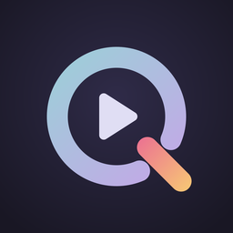
  <div class="qr-store-text">
    <strong>QRemote for Quarto</strong>
    <span>iPhone and Apple Watch · Free</span>
  </div>
  <a href="https://apps.apple.com/app/id6819984818" class="qr-badge"></a>
</div>
```

::: {.qr-note}
QRemote Relay for Mac is coming soon to the App Store.
:::

| App | Runs on | Does |
|---|---|---|
| **QRemote** | iPhone (iOS 18 or later) | Remote with your notes; sets up the watch |
| **QRemote** for Apple Watch | Apple Watch (watchOS 11 or later) | Remote on your wrist; buzzes when time is up |
| **QRemote Relay** | Mac (macOS 15 or later) | Links the presentation in your browser to the remotes |

You also need a presentation that uses the [`qremote` extension](extension.qmd).

## iPhone

::: {.qr-shots}
::: {.light-content}
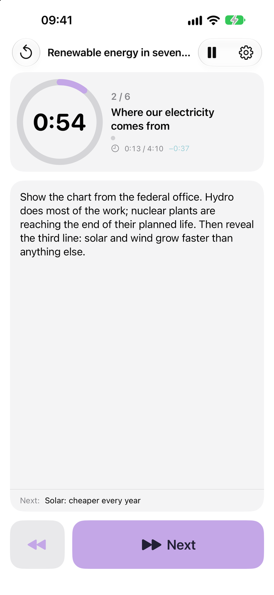{.qr-phone fig-alt="iPhone: countdown, slide title, speaker notes, next slide's title, Back and Next buttons"}
:::

::: {.dark-content}
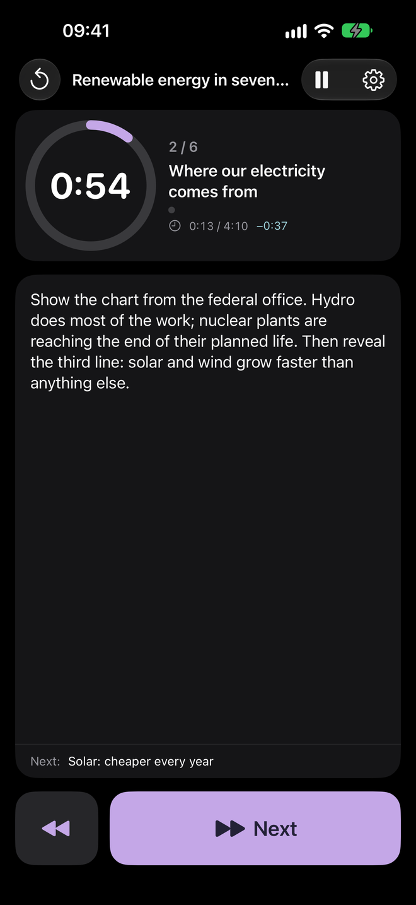{.qr-phone fig-alt="iPhone: countdown, slide title, speaker notes, next slide's title, Back and Next buttons"}
:::

::: {.light-content}
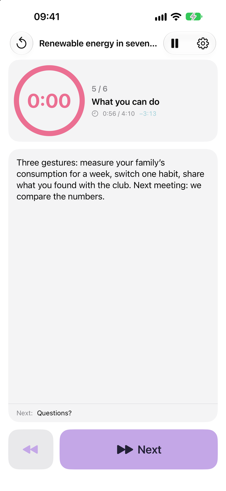{.qr-phone fig-alt="iPhone: the ring and the number turn red when the slide's time is up"}
:::

::: {.dark-content}
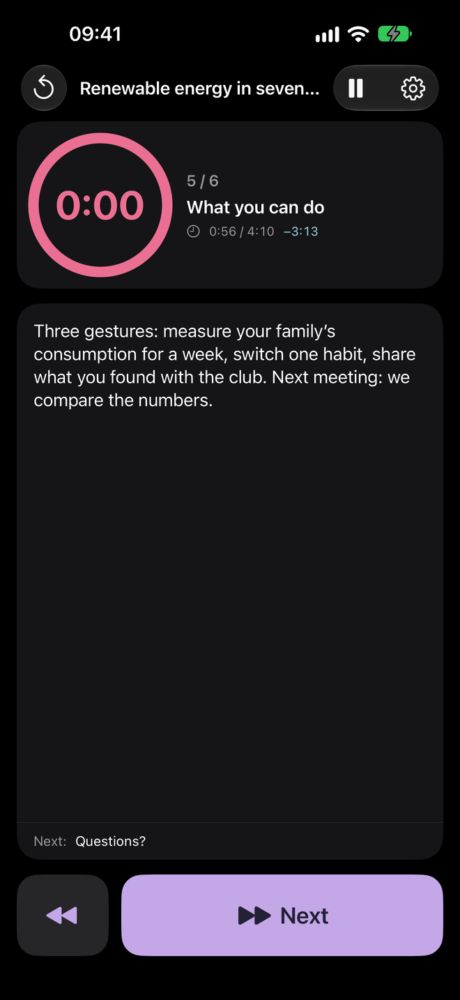{.qr-phone fig-alt="iPhone: the ring and the number turn red when the slide's time is up"}
:::

::: {.light-content}
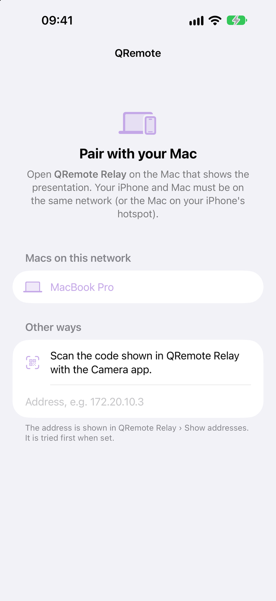{.qr-phone fig-alt="iPhone: Pair with your Mac, with the Mac found on the network"}
:::

::: {.dark-content}
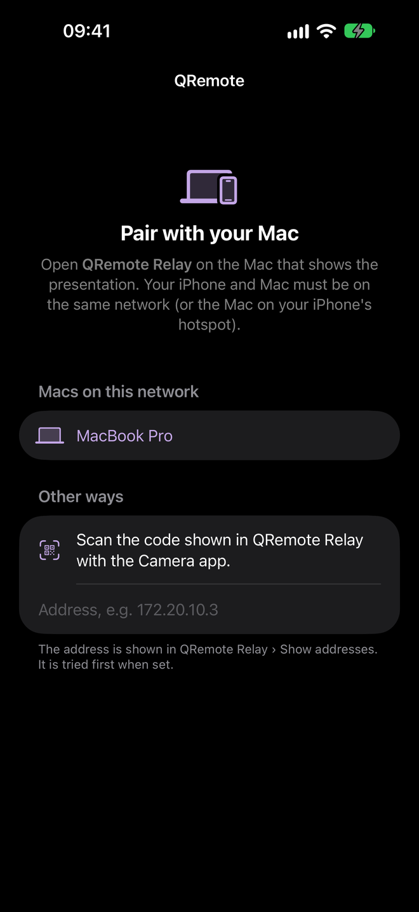{.qr-phone fig-alt="iPhone: Pair with your Mac, with the Mac found on the network"}
:::
:::

- **Next** (large) and **Back** at the bottom, within reach of your thumb; **pause** and **reset** at the top.
- The slide's **countdown** (or, on untimed slides, the time spent on it), the slide's title and its steps.
- The **total time** against the plan: `+0:12` means you are 12 seconds behind, `−0:30` ahead.
- Your **speaker notes**, and the title of the next slide.
- The screen stays on while you present.

## Apple Watch

::: {.qr-shots}
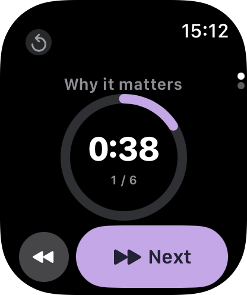{.qr-watch fig-alt="Apple Watch: the slide's title, its countdown, and the slide number"}

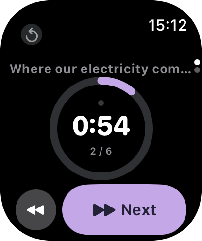{.qr-watch fig-alt="Apple Watch: a dot above the time for each step of the slide"}

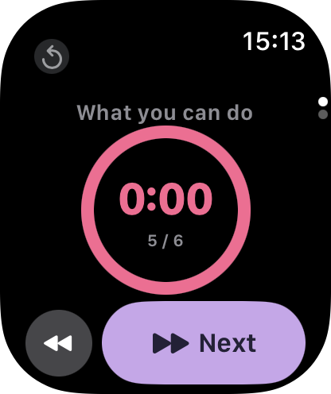{.qr-watch fig-alt="Apple Watch: the ring and the number turn red"}

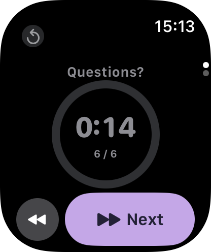{.qr-watch fig-alt="Apple Watch: grey number counting up the time spent on an untimed slide"}
:::

| On the watch | Effect |
|---|---|
| **Double tap** or **Next** | Next step or slide (double tap: Apple Watch Series 9, Ultra 2 and later) |
| **Back** (small round button) | Previous |
| **↺** (tiny, top left) | Reset the clocks (asks for confirmation) |
| Long press on the ring | Pause / resume |
| Turn the Digital Crown | Second page: link status, total time, ahead / behind, pause, settings |
| Light buzz | A few seconds before the end of the slide (setting: never, 3, 5 or 10 s) |
| Two strong buzzes | Time's up |

The watch keeps counting and buzzing with your wrist down, for talks of up to an hour. To keep QRemote on screen when you raise your wrist: iPhone › **Watch** app › General › **Return to Clock** › QRemote › *After 1 hour*.

## QRemote Relay (Mac) {#qremote-relay-mac}

::: {.light-content}
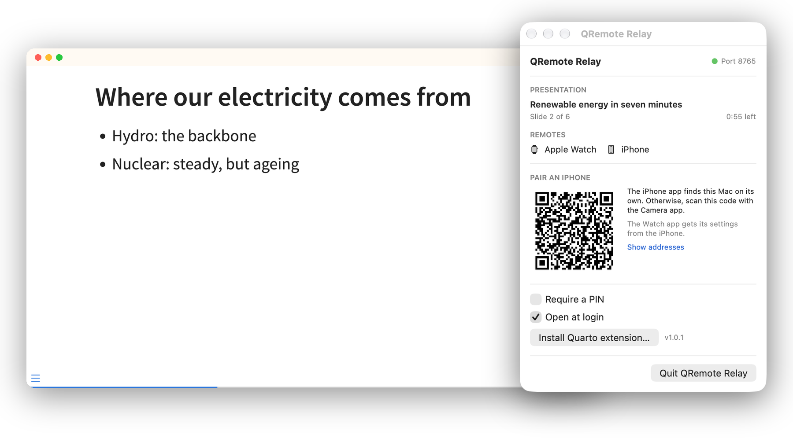{.qr-mac fig-alt="A presentation in a browser window, and the QRemote Relay menu: the open presentation, the connected remotes, the pairing code"}
:::

::: {.dark-content}
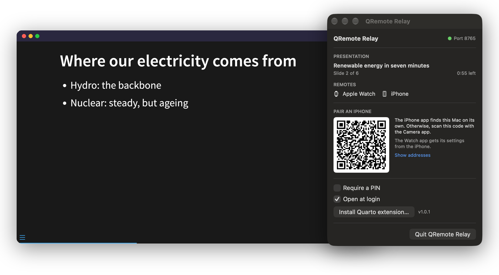{.qr-mac fig-alt="A presentation in a browser window, and the QRemote Relay menu: the open presentation, the connected remotes, the pairing code"}
:::

QRemote Relay lives in the menu bar. It links the presentation open in your browser to your remotes:

- the presentation **connects on its own** as soon as you open it on this Mac;
- your iPhone **finds the Mac** on the local network, or scans the **pairing code** from the menu with the Camera app;
- the menu shows the open presentation, the current slide and the connected remotes;
- **Require a PIN**, so nobody else on the network can drive your slides;
- **Open at login**, so it is always there before a talk;
- **Install Quarto extension…** copies the extension into a presentation folder.

## Before a talk

::: {.qr-steps}
1. **Network.** Your iPhone and your Mac on the same network. Safest in a classroom or a conference room: the **Mac on your iPhone's Personal Hotspot**, since many institutional Wi-Fi networks keep devices from seeing each other.
2. **Mac.** QRemote Relay is running (remote icon in the menu bar; it fills in when a presentation is connected). Open the rendered presentation in your browser.
3. **iPhone.** Open QRemote. The first time, tap your Mac in the list and allow *Local Network* access.
4. **Watch.** Open QRemote. It uses the Mac chosen on the iPhone.
5. **Test.** Tap Next: the presentation moves and the countdown starts.
:::

## Settings

| Setting | Where | |
|---|---|---|
| Mac, address, PIN | iPhone › ⚙︎ | The watch receives them from the iPhone. Without the iPhone: watch › second page › Settings. |
| Buzz before the end | iPhone › ⚙︎ (or the watch) | Never, 3, 5 or 10 seconds |
| PIN | Mac › menu › Require a PIN | Shown in the menu and included in the pairing code |
| Open at login | Mac › menu | |

Problems? See [Support](support.qmd).
